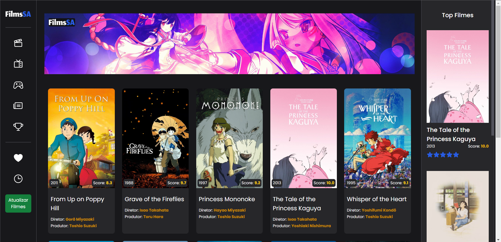

<h1 align="center">
     FimlsSA

</h1>

<h3 align="center">
    Streaming de animes
</h3>

<p align="center">
  

  
  
  <a href="https://github.com/MiguelMarcola/project-filmsSA/commits/main">
    
  </a>
    
   
  
  
  
 
</p>

<h4 align="center">
	🚧   Concluído 🚀 🚧
</h4>

## 💻 Sobre o projeto

FilmsSA - é uma aplicação desenvolvida em React.js com Vite e Typescript que consome uma api Nodejs construida com Nestjs, trata-se de uma página que lista os filmes da api, realiza uma listagem páginada de 10 em 10 e possui uma side bar que mostra os 3 filmes com as maiores notas, o usuários pode apertar o botão atualizar no medu para chamar a api para consultar se existem novos filmes para salvar na base, essa ação retorna uma mensagem de acordo com o resultado dessa requisição.

---

## ⚙️ Funcionalidades

- [x] Consulta 50 filmes, extrai as informações.
- [x] End-point de consulta com paginação de 10 em 10 a todos os filmes que estão no nosso banco de dado.
- [x] End-point de consulta dos 3 filmes com maior nota no banco de dado.
- [x] End-point que faz a consulta aos 50 filmes e atualiza nosso banco de dados.
- [x] Tela com a exibição dos filmes consultando de forma paginada ao back-end da aplicação.
- [x] Tela com a exibição dos 3 filmes com maior nota.
- [x] Botão de atualizar que acessará o end-point que faz a consulta aos 50 filmes e atualiza nosso banco de dados.
- [x] Testes unitários.
---

## 🎨 Layout

<p align="center">

  

</p>

---

## 🚀 Como executar o projeto

### Pré-requisitos

Antes de começar, você vai precisar ter instalado em sua máquina as seguintes ferramentas:
[Git](https://git-scm.com), [Node](https://nodejs.org/), [Docker Desktop](https://docs.docker.com/desktop/). 
Além disto é bom ter um editor para trabalhar com o código como o [VSCode](https://code.visualstudio.com/).

#### 🎲 Clonando o repositório e instalando as dependências

```bash

# Clone este repositório
$ git clone https://github.com/MiguelMarcola/project-filmsSA.git

# Acesse a pasta do projeto web no terminal/cmd
$ cd project-filmsSA/web

# Instale as dependências web
$ npm install

# Acesse a pasta do projeto server no terminal/cmd
$ cd ../server

# Instale as dependências web
$ npm install

```

Para o funcionamento de todas as funcionalidades do App será necessário criar um arquivo ".env" na raiz da pasta server projeto (project-filmsSA/server) contendo as variáveis de ambiente do banco de dados.

```
#DATABASE
DATABASE=films
DATABASE_USER=root
DATABASE_PASSWORD=s3cr3t
DATABASE_PORT=5432

```

Estas são as mesmas configuração presentes no docker-compose.yml

#### 🎲 Rodando Back-end

```bash

# Acesse a pasta do projeto server no terminal/cmd
$ cd project-filmsSA/server

# Com o docker instalado rode o seguinte comando para criar o nosso banco de dados
$ docker-compose up -d

# Execute a aplicação em modo de desenvolvimento
$ npm run start

# O servidor inciará na porta:3001 - acesse http://localhost:3001/docs e terá acesso a documentação da api

```

#### 🎲 Rodando Front-end

```bash

# Acesse a pasta do projeto server no terminal/cmd
$ cd project-filmsSA/web

# Execute a aplicação em modo de desenvolvimento
$ npm run dev

# O servidor inciará na porta:5173 - acesse http://localhost:5173/

```

As seguintes ferramentas foram usadas na construção do projeto:

#### **Website**  ([Reactjs](https://reactjs.org/)  +  [TypeScript](https://www.typescriptlang.org/) + [Nodejs](https://nodejs.org/en/) + [Nestjs](https://nestjs.com/))

-   ReactJs
-   Vite
-   TailwindCSS
-   Axios
-   Toast
-   NodeJs
-   NestJs
-   Swagger
-   Jest

> Veja o arquivo Back-end  [package.json](https://github.com/MiguelMarcola/project-filmsSA/blob/main/server/package.json)
> Veja o arquivo Front-end  [package.json](https://github.com/MiguelMarcola/project-filmsSA/blob/main/web/package.json)

## 🦸 Autor


 <br />
 <sub><b>Miguel Marçola</b></sub></a> 🚀
 <br />

[](https://www.linkedin.com/in/miguel-mar%C3%A7ola-28535a151/) 
[](miguelmarcola@gmail.com)

---

## 📝 Licença

Este projeto esta sobe a licença [MIT](./LICENSE).

Feito com muita dedicação por Miguel Marçola 👋🏽 [Entre em contato!](https://www.linkedin.com/in/miguel-mar%C3%A7ola-28535a151/)

---

